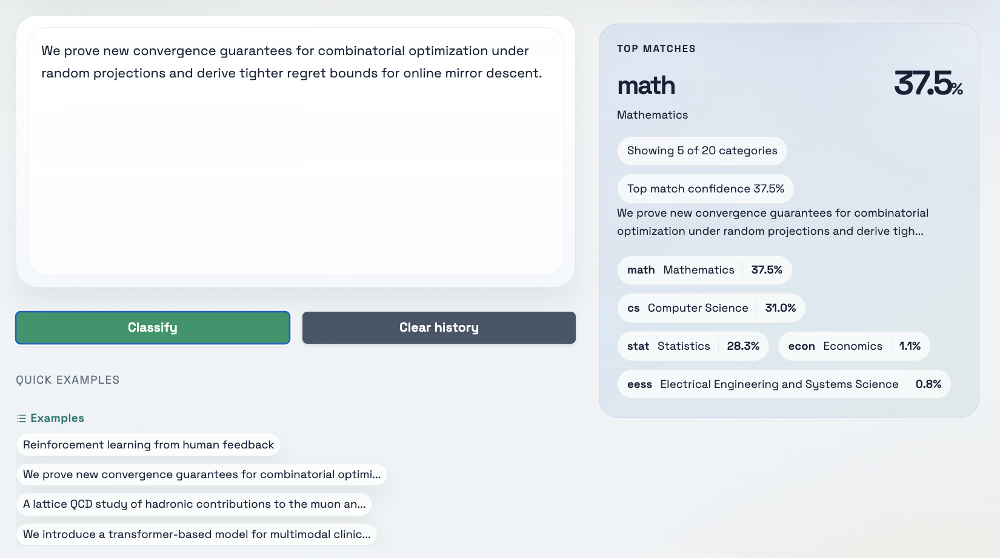

[](https://huggingface.co/spaces/mgoloshchapov/PaperClassified)




## Project description

The project implements simple arXiv categories paper classifier. It uses SciBERT+Classifier head model trained over [CLS] token to predict article category given title, abstract or any part of the article text. Check [description.md](description.md) for more details.

## Environment setup

If you don't have `uv` package manager, first download it

```bash
curl -LsSf https://astral.sh/uv/install.sh | sh
```

After that you can download all necessary packages. By default the model
and training are done either on 'cpu' or 'mps' for which you need to have Apple M-series processor

```bash
uv sync
```


## Enrty point


You can run trained model exported in onnx using this command

```python
uv run main.py --top_k=3 "Reinforcement learning from human feedback"
```

```
cs: Computer Science
stat: Statistics
```

## Training

To download data from kaggle https://www.kaggle.com/datasets/Cornell-University/arxiv?resource=download and preprocess it with SciBert just run this script. After that the original data and processed data train, test, val splits will be stored in `data/` folder.

```python
uv run src/prepare.py
```

After that you can run training with `uv run src/train.py` and optimization of hyper-parameters with `uv run src/hyper_optimization.py`. To evaluate the model, you can run `uv run src/evaluate.py.

Also, the repo supports TF-IDF model baseline. To run training and evaluation follow these steps

```python
uv run src/prepare.py
uv run baseline/prepare_tfidf.py
uv run baseline/evaluate_tfidf.py
```

If you want to run hyper-parameter optimization for TF-IDF model, just run

```python
uv run src/hyper_optimization.py data=tfidf model=tfidf
```
And in separate terminal you can start optuna-dashboard server using

```python
uv run optuna-dashboard sqlite:///optuna_study.db
```
## Metrics

Results of evaluation on 2.5k size test dataset after training on 10k size train dataset and hyper-parameter optimization on 2.5k validation dataset

| Model | top@1 | top@2 |
| ----- | ----- | ----- |
| __Naive frequency based__ | 0.314 | 0.514 |
| __TF-IDF+Classifier__   |  0.802 | 0.899 |
| __SciBERT+Classifier__  |  0.892 | 0.956 |


## Useful commands

- `uv run src/train.py` - launches training of model with SciBERT text embeddings
- `uv run src/train.py data=tfidf model=tfidf` - launches training of model with TF-IDF text embeddings
- `uv run src/evaluate.py split=test` - launches evaluation of main model on train data
- `uv run src/evaluate.py split=test data=tfidf model=tfidf` - launches evaluation of TF-IDF model on test data
