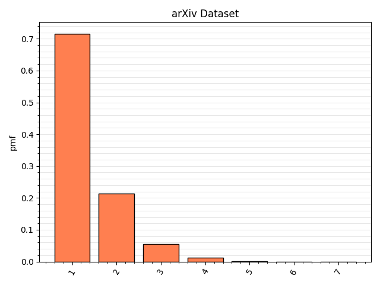
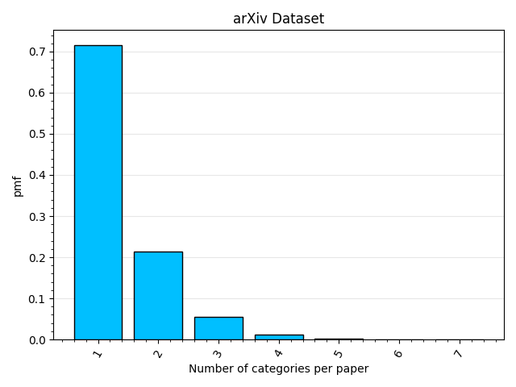
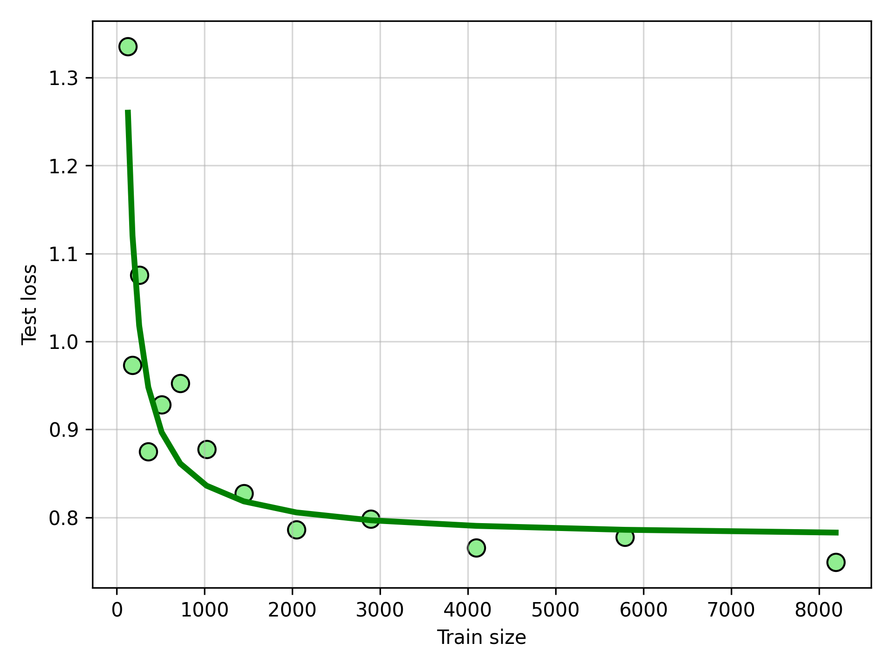
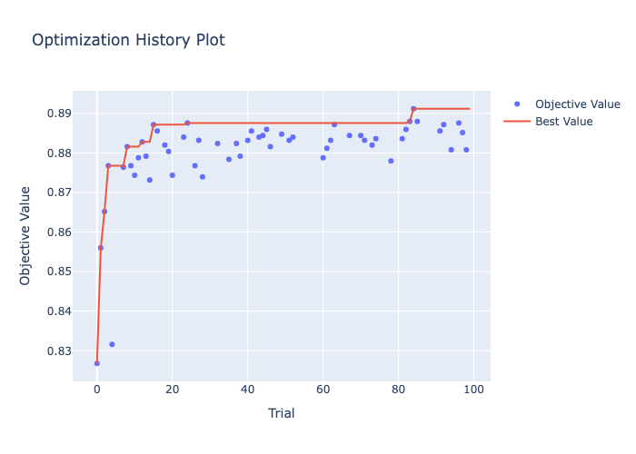

## Data

I use publicly available kaggle arXiv Dataset https://www.kaggle.com/datasets/Cornell-University/arxiv?resource=download. It contains around 1.7 million arxiv papers, and I use around 15k for train(10k), test(2.5k) and validation(2.5k).

## Data distribution

First thing to consider before making a classifier is data distribution. For example, how balanced is our dataset? It turns out that it's not, just as expected.

Mostly, we have Computer Science and Math papers with such categories as Quantitative Finance, Economics, High Energy Physics - Lattice, Nuclear Experiment almost missing. This motivates to weight the cross-entropy loss with class counts.

While it might be useful to group such categories as Quantitative Finance and Economics or High Energy Physics - Experiment, High Energy Physics - Lattice, High Energy Physics - Phenomenology, High Energy Physics - Theory together, I intentionally left categories as they appear on arXiv, so that I can output categories as they appear on arXiv.

Also, we can collect distribution of number of categories per paper. We can see that most papers contain single category, and almost no papers contain more than 3 categories.

## Embeddings and HF model

Both the Hugging Face model and TF-IDF vectorizer precompute embeddings of texts to save time during training of classifier head.

The base model is SciBERT https://github.com/allenai/scibert, and I use [CLS] token as text embedding.

Split data in train, test, val and precompute embeddings with SciBERT: `uv run src/prepare.py`

Train TF-IDF encoder and precompute embeddings: `uv run baseline/prepare_tfidf.py`

## Training

Training is implemented as multiclass classification with soft labels. For example, if the paper has categories ['cs', 'math', 'quant-ph'], then the label
will be encoded as vector with three non-zero entries equal to 1/3 on respective positions.

As for the loss function I use cross-entropy loss weighted by class ratios in training data.

Trainig is done on 10k samples from arXiv Kaggle dataset. I found that this is enough to receive good quality of the classifier head on top of SciBERT(basically, a projection from embeddings to class probabilities), and further increasing of training data size doesn't give substantial gains.

## Comparison to baselines

First, it's useful to discuss how the model decodes output and what metrics are used to evaluate the quality.

The default decoding scheme takes `top_k`=3 most probable classes and outputs them as an answer. I decided to make this choice in favor of `top_p` decoding because in the worst case the model just outputs all classes except just few. For example, with 20 categories present, the model can output 19 categories for one paper with `top_p`=0.95. In this case the model that always outputs 19/20 most frequent categories might look well in terms of metrics, but hardly produce any useful output.

As for the metrics, I use top@1 and top@2 scores. In general, top@k metric outputs 1 for an example, where model outputs contains at least k categories from the ground truth categories.

That gives us two baselines:
- naive model that always outputs `top_k`=3 most probable classes
- TF-IDF embedder + classifier head

## Hyper-parameter optimization

Hyper-parameter optimization is done via Optuna package, and the optimization is applied both to main model and TF-IDF baseline for comparison. The results of hyper-parameter optimization are shown below. As the result test top@1 increased from ~0.83 to ~0.89 for the main model. All the optimization is done for train data size 10k.

Hyper-parameter optimization for TF-IDF is also performed, it increased test top@1 from to ~0.73 to ~0.80. If the hyper-parameter optimization is avoided, it's possible to misinterpret results and overestimate main model performance over the baseline.
